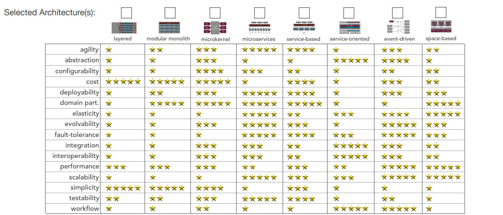

# Decision on Fundamental Architecture Style
## Context
Our organization is in the process of designing a new Customer Management Platform (CMP) system, and we need to make a decision on the architectural design for same. This decision is crucial as it will significantly impact the scalability, maintainability, and flexibility of the system.
## Status
Accepted
## Decision-Making Process
To guide our decision-making process, we will leverage the "Architecture Styles Worksheet" introduced by Mark Richards, available at https://www.developertoarchitect.com/resources.html. This worksheet provides a systematic approach to evaluating key architectural characteristics and selecting the most suitable architecture style for our project.
## Key Architectural Characteristics
We have identified the following key architectural characteristics that are essential for the success of the new Customer Management Platform :
1. Scalability: The ability to handle a growing number of users, data, and transactions efficiently.
2. Maintainability: Ease of maintaining, updating, and evolving the system over time.
3. Flexibility: The ability to adapt to changing business requirements and integrate with other systems. 
4. Resilience: The ability to recover gracefully from failures and ensure high availability.
5. Speed of Delivery: Rapid development and deployment of new features and updates.
Prior to immersing ourselves in the architecture design phase, it is crucial that we establish a unanimous agreement on the foundational architectural style for our system. This choice bears considerable importance, as making adjustments later in the process could incur significant costs. Hence, this stands as our initial decision in the process
To facilitate this decision-making process, we are leveraging an "Architecture Styles Worksheet" introduced by Mark Richards, available at https://www.developertoarchitect.com/resources.html.

## Architecture Styles Evaluation
We will evaluate the following architecture styles using the provided worksheet:
1. Monolithic Architecture
2. Microservices Architecture
3. Service-Oriented Architecture (SOA) 
4. Event-Driven Architecture
       
## Decision
After a thorough evaluation based on the Architecture Styles Worksheet, we have decided to favor the Microservices Architecture for the new Customer
Management Platform.
## Rationale

1. Scalability: Microservices architecture allows for independent scaling of services, enabling us to scale specific components based on demand.
2. Maintainability: With microservices, each service can be developed, deployed, and maintained independently, facilitating easier maintenance
and updates without affecting the entire system.
3. Flexibility: Microservices provide the flexibility to choose the right technology stack for each service, facilitating easier integration with other
systems and adaptability to changing business requirements.
4. Fault tolerance & Resilience: Isolation of services in microservices architecture ensures that a failure in one service does not bring down the
entire system, contributing to overall system resilience.
5. Speed of Delivery: Microservices enable faster development cycles, allowing us to deliver new features and updates more rapidly.

## Implications
1. Organizational Change: Adopting microservices may require a shift in organizational culture and processes to align with the decentralized nature of microservices development.
2. Operational Complexity: Managing a microservices-based system introduces challenges in terms of operational complexity, monitoring, and orchestration.
