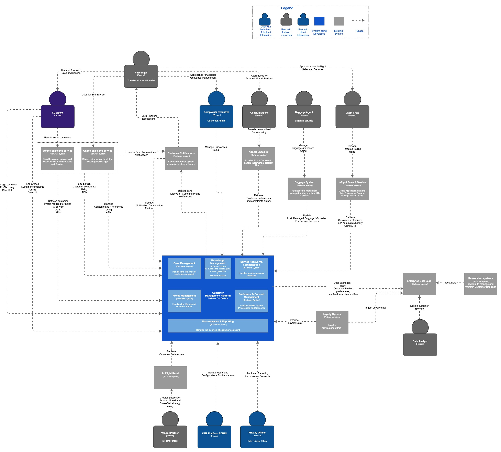
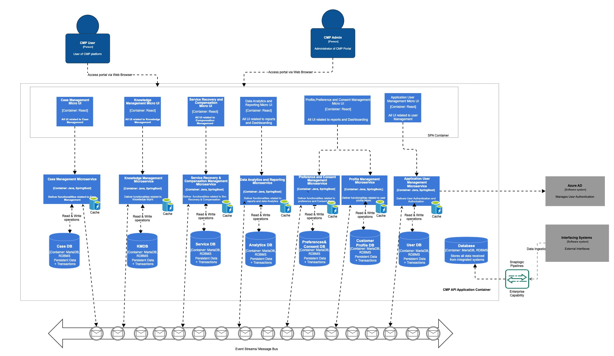
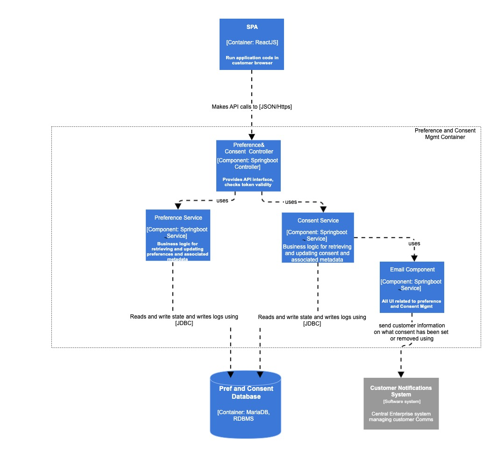
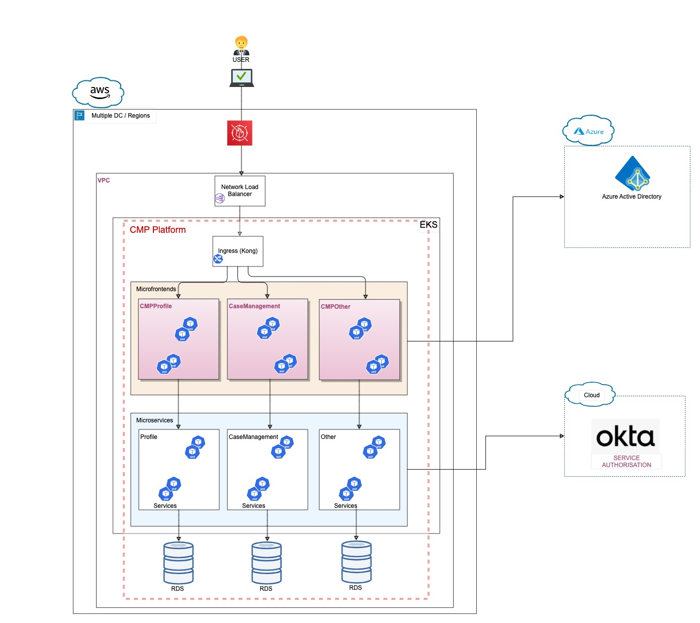
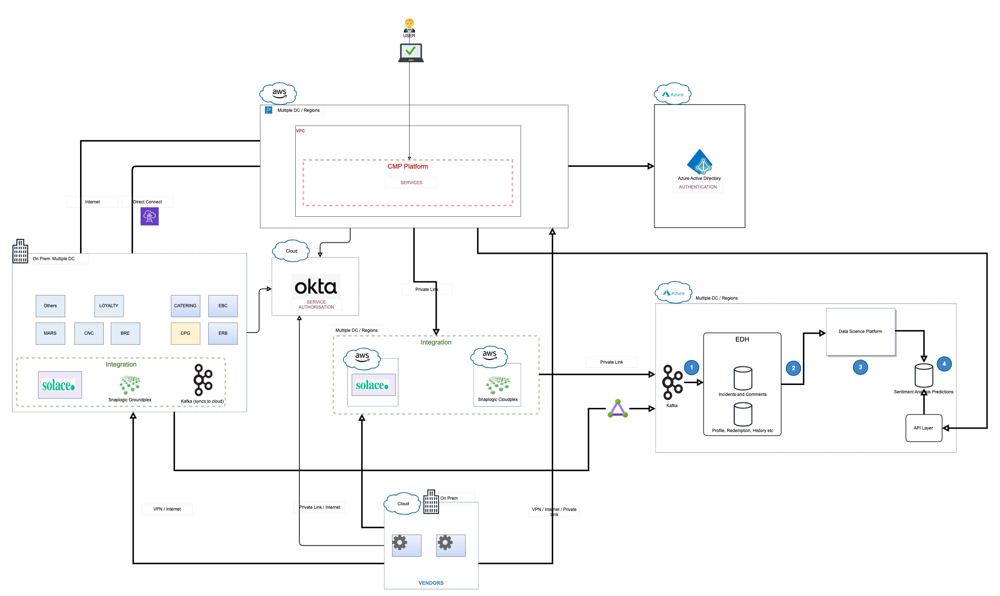
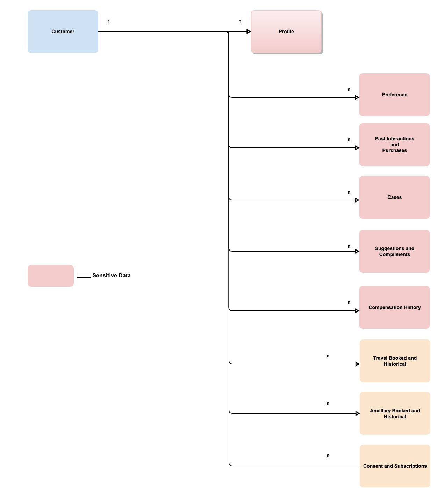

# Architecture Katas - Customer Management Platform

## Business Case:
A leading airline is striving to build a comprehensive Customer Management Platform solution that enables the foundation of data driven, customer centric organization. This platform should enable to manage customer information across the ticket booking platforms both online and agents, call centre , check in desks, customer affairs and services, in flight retail, lounges, chauffer driven services and baggage services

## Business Drivers / Current Challenges
Poor customer experience
Lack of customer insights
Absence of customer's historical interactions/transactions
Lack of automated service recovery options.
Complex system landscape leading to cumbersome data privacy management
Business Goals
Create detailed and comprehensive customer profiles
Coupled with analytical tools, allow airline to remain closely engaged with the customers
Create a seamless travel/customer experience.
Build personalized and tailored interactions and offers.
Tailor a marketing campaign to specific profiles.
Drive the sale of ancillary products and services.
Proactive grievance management and service recovery.
Enhance customer satisfaction and fuel customer retention.
Increase revenue and profit.

## Architecture Vision
The architecture vision  for this solution.
Integration of all available pieces of customer data to create a holistic view of the customer.
Utilise data as a differentiator to enhance and personalize the organisations offerings
Provide advanced data analytic tools that can be used to uncover insights, identify patterns, predict outcomes, and generate recommendations.
Create a solution utilizing latest technology stacks that is interoperable and can scale in order to sustain the business growth and adapt to organisation changes.
Plan and provision application resources that are cost efficient.
Design application, hosting and deployment methods will be cloud agnostic. 
Implement automation processes on repetitive tasks to minimise error and in order to FastTrack time to market
Ensure comprehensive Identity and access management framework.
Comply with GDPR, preserve anonymity in compliance with privacy regulations
Conform to PCIDSS and other regulatory requirements.
Provision comprehensive logging and auditing of all consumer data access and modifications.
Create consistent, user friendly and intuitive UI designs to improve user experience.
Platform components should be designed to provide a omni channel consistent brand experience.

## Architecture Principles
Sr#	Name	Description
1	Future Proof	Technology must be viable for our use not only today but also in the foreseeable future.
2	Interoperability	Technology must be capable to work with other technologies in the landscape.
3	Maintainability	
Capability of Technology to
Support changes gracefully in existing solutions deployed in this technology
Support enterprise automated environment management and automated release management processes. If not, technologies should have alternatives to ensure seamless environment management and release management capabilities
Customisations done are supported and scalable with future releases
4	Abstraction	
Where possible, the underlying complexity of any technology should be presented through higher levels of abstraction.
5	Portability	
Technology should be portable as much as possible at all levels.
For example:
It should be possible to deploy in house as well as on the cloud etc.
Data handled or stored by any technology should be easily extracted.
6	Choose Right Fit Solutions	
Commercial-off-the-shelf (COTS) packages should be selected based on their fit to the identified functional and non-functional requirements.
Common use applications are preferred over custom solutions
Platforms preferred over best of breed solutions.
Adopt industry standard business process and integrations instead of Adapting the business process to prescribed standards
7	Design for failure	
Solutions must be designed to ensure that the applications can fully or partially available and or recover from software or infrastructure failures.
8	Separation of Concerns	Solutions are divided into discrete software components which are autonomous in nature.
9	Design to meet SLA	
It is important that solutions are designed and developed with non-functional requirements in mind to meet service levels agreements offered to our customers. 
10	Loosely coupled, interoperable integrations 	
Solutions share well-defined integration points, which are standards based, interoperable and loosely coupled.
11	Customer Centric Design 	
Every hardware and software solution should be designed to comply with universal design guidelines and where required accessibility requirements.

## System Requirements

### Stakeholders

This section describes key stakeholders of the system and their architectural concerns.
SH-1: Contact Centre Agent 
Provides customer service with regard to flight and ancillary bookings, also handles calls related to service disruption.
SH-2: Airport Check-in Agent 
Provides customer service with regard to flight check-in, ancillary bookings, flight boarding and also handles passenger greviences related to service disruption.
SH-3: Marketing Manager 
Creates marketing campaigns and promotions.
SH-4: Data Privacy Officer 
Manages customer data privacy requirements for the Organisation.
SH-5: Loyalty Manager  
Drives loyalty offers and new product development.
SH-6: Cabin Crew  
Provides service to customers inflight and also promotes inflight sales.
SH-7: CMP Manager  
Configures rules and policies and drives requirements for enhancing the platform
SH-8: Customer Affairs Executive  
Handles customer complaints and compensation.
SH-9: Data Analyst  
Consolidates data from various operational systems to construct a thorough customer 360 view and unearth insights about customers in order to enhance Average Revenue per Customer
(ARPC).
SH-10: Inflight Retailer  
Creates suitable product bundles for cross-selling during in-flight retail.
SH-11: Cyber Security Operations Manager
Ensures that there are no security breaches in the system

### Business Requirements

Sr#	Capability	Key Business
Requirements
1	Customer Profile Management	
Detailed and comprehensive customer profiles that include (BR - 01)
Personal information
Travel history 
Preferences 
Past interactions.
A centralized repository that aggregates and stores customer data from various touchpoints and systems. (EN - 01)
Tools for segmenting customers based on various criteria such as (BR - ) 
Travel history
Preferences
Loyalty status. 
Personalization features to tailor interactions and offers to individual  customers. (BR - ) 
Capability to share profile data with strategic partners while preserving anonymity in compliance with privacy regulations, while also revealing essential insights into segments, preferences, and choices. (BR - ) 
2	Customer Interaction Management	
Logs of all past interactions, including calls, emails, chats, and in-flight retail purchases, stored within customer profiles. (BR - ) 
A chronological timeline view of each customer's interactions and transactions, allowing for easy tracking and reference. (BR - ) 
Critical information from customer feedback data, into customer profiles, including (BR - ) 
Complaints,
Compliments,
Cases and
Suggestions
3	Customer Order Management	
Capture and store customer preferences related to orders, such as (BR - )
Meal choices 
Seating preferences.
Personalization of future orders based on customer preferences. (BR - )
Integration with customer support and complaint handling systems to address order related issues promptly. (BR - )
4	Compensation Management	• Automated Compensation calculation and processing based on rules and policies
• Support for multiple compensation scenarios, flight cancellation, delays, and baggage
mishandling.
•Notifications regarding compensation resolutions
5	Case Management	• Case creation, prioritization, tracking and updates.
• Case Assignment, Routing, and escalation capabilities
• Customer Self service capabilities
•Notifications regarding case status and closures
6	Customer Analytics Capabilities	• Data collection mechanisms from all the touchpoints to gather information on
passenger interactions, preferences, and behaviours.
• Real-time data processing and analysis to provide timely insights and responses
• Advanced analytics capabilities including machine learning, and predictive analytics.
• Sentiment analysis of customer feedback and social media mentions to gauge
passenger satisfaction
• Capability to envisages various actions that could be implemented for a specific
customer and then chooses the best possible option to implement
7	 Easy to Use	• Intuitive, multi-channel and user-friendly interfaces for passengers, call centre agents, check-in agents, cabin crew, service management and retail staff.
• Simplified navigation and clear layouts to access customer profiles and historical data.
8	 Secured Platform	• Right authentication and authorization implemented
• Supports RBAC & MFA
• Sensitive data encrypted at rest and transit
• Conforms to GDPR, PCIDSS and other regulatory requirements.
• Comprehensive logging and auditing of all customer data access and modifications.

## Assumptions
The Analytics and reporting module provides near real-time data analysis for up-to-the-minute insights into customer interactions and trends which is largely reliant on the data received from source systems.
Businesses often have varying processes for handling customer cases, and the module should would be a generic 
The enterprise data lake serves as a robust foundation for our advanced customer analytics , harmonizing a myriad of customer data sources to provide a panoramic 360-degree perspective on customer behaviours and preferences.
The CMP platform's user access needs will be efficiently addressed through a user-friendly, responsive web application, eliminating the necessity for a dedicated app and ensuring seamless accessibility for users across diverse devices and platforms.
The marketing platform as an external entity to the CMP platform system allowing this platform to excel in its specialized functions. This segregation ensures streamlined maintenance, facilitates updates without disrupting CRM operations, and allows for the independent evolution of marketing strategies, ultimately optimizing overall performance.
The successful integration and utilization of the new Customer Management Platform within the organization will be contingent upon seamless and efficient data extraction, transformation, and loading (ETL) processes facilitated by the enterprise SnapLogic ETL/ELT platform.
The effectiveness of implementing and operating the new Customer Management Platform will depend on the smooth integration and efficient communication enabled by the Enterprise Message broker . This assumption envisions that the message bus will adeptly manage the real-time exchange of data and information between the CMP system and other interconnected enterprise applications.
   

## System context diagram

## Container diagram

## Component diagram - Preference and Consent Management

## Deployment Diagram

Environments - The CMP instances will be deployed across multiple environments
Production environment: The production environment provides live services to your user base.
Tier 1 SLA. deployed across several regions to provide redundancy and infrastructure fault tolerance.
Process numbers of transactions and requests based on the business requirement.
Development environment: Used for creating the application features. Limited number of users and data.
Test environments: Environment to test performance, conduct UAT related to new feature and backup and restore procedures.
Application Tiers
Web Tier
Micro frontends will be created and deployed for each domain functionality e.g. Profile, Case management etc 
Provides HTTPS content to the client.
Application Tier
Microservices will be created and deployed
Database Tier
Consists of RDS databases. Backend services will interact with database to source data.
Database will be deployed as active and standby. Active DB will replicate to standby.
General guidelines
Separate CI/CD per micro frontend /microservice for build and deployment of each image.
Pipelines will contain Quality and Security checks
Services will be deployed on EKS
Deploy in antiaffinity mode with autoscaling
Each data centre should have sufficient capacity to be able to take the full application load in the event of any failure.
In event of failure configure health checks for automated failover.
Backups and disaster recovery drills will be carried out to ensure set RPO and RTO can be met.

.
## Integration Diagram

## Domain and Data Architecture

Please capture the main data assets used by the initiative and their relationships. A sample model is presented below. When the further details become available, the model can be elaborated to a logical level. Please note the model is at the conceptual level.

Sr#	Category	Data element	Source	Destination	Information Classification	Data Format	Integration Method	Remarks
1	Profile	Unique Profile ID, Email address, Phone number, Title, Last name, First name, Middle name,  Loyalty Number, Loyalty status, Passport number, Nationality, Passport expiry, Gender, Address, Device details, browser details, location.	
Loyalty
Channels
GDS
Partners
CMP	Sensitive data	

2	Preferences	Seat, meal, drink 	Loyalty > EDH	CMP	

Customer Self service capabilities
3	Past Interactions	Calls, Emails, Chats 	CC Voice Platform	CMP	

5	Case Management	Complaints, Resolution, Status	Channels 	CMP	

 Case creation, prioritization, tracking and updates. Case Assignment, Routing, and escalation capabilities. Notifications regarding case status and closures
7	Compensation	Compensation history	Finance	

Automated Compensation calculation and processing based on rules and policies. Notifications regarding compensation resolutions
10	
Consent and Subscriptions
Related attributes	

6	Suggestions and compliments	Related attributes	

chronological timeline view,
8	
Travel Booked 
and Historical
PNR, Flight details (Flight number, Departure airport, Arrival airport , date of travel, class of travel), E-Ticket number, Status (On Time, No Show, Delay, Involuntary Rebooked), Gate Number, Date of travel, Bag Tag number	Mainframe > EDH	

9	
Ancillary Booked 
and Historical
Ancillary Type, Ancillary related attributes, Status (Fulfilled, service disruption)	Mainframe > EDH	

4	Purchases	In flight purchases, EK websites purchases	

Personalization of future orders based on customer preferences.
11	
Post Order
Shipment details, Invoice	

12	
Flight Segment forecast
Cabin, RBD, Load	Mainframe > EDH	

13	
Business Rules
Rules	CMP	CMP	

14	
Knowledge Management
Knowledge articles and SOPs	KMS	

16	Profile	Unique Profile ID, Email address, Phone number, Title, Last name, First name, Middle name,  Loyalty Number, Loyalty status, Passport number, Nationality, Passport expiry, Gender, Address, Device details, browser details, location.	CMP	Channels 	

17	Preferences	Seat, meal, drink 	CMP	Channels 	

18	Compensation	Compensation history	CMP	Channels 	

## Architecture Decision Records
Key decisions taken for the implementation of the interfaces:
Architectural Decision Record (ADR)
Link to confluence 
Decision on Fundamental Architecture Style

Context
Our organization is in the process of designing a new Customer Management Platform (CMP) system, and we need to make a decision on the architectural design for same. This decision is crucial as it will significantly impact the scalability, maintainability, and flexibility of the system.
Status
Accepted
Decision-Making Process
To guide our decision-making process, we will leverage the "Architecture Styles Worksheet" introduced by Mark Richards, available at https://www.developertoarchitect.com/resources.html. This worksheet provides a systematic approach to evaluating key architectural characteristics and selecting the most suitable architecture style for our project.
Key Architectural Characteristics
We have identified the following key architectural characteristics that are essential for the success of the new Customer Management Platform :
Scalability: The ability to handle a growing number of users, data, and transactions efficiently.
Maintainability: Ease of maintaining, updating, and evolving the system over time.
Flexibility: The ability to adapt to changing business requirements and integrate with other systems.
Resilience: The ability to recover gracefully from failures and ensure high availability.
Speed of Delivery: Rapid development and deployment of new features and updates.

Prior to immersing ourselves in the architecture design phase, it is crucial that we establish a unanimous agreement on the foundational architectural style for our system. This choice bears considerable importance, as making adjustments later in the process could incur significant costs. Hence, this stands as our initial decision in the process
To facilitate this decision-making process, we are leveraging an "Architecture Styles Worksheet" introduced by Mark Richards, available at https://www.developertoarchitect.com/resources.html.

Architecture Styles Evaluation
We will evaluate the following architecture styles using the provided worksheet:
Monolithic Architecture
Microservices Architecture
Service-Oriented Architecture (SOA)
Event-Driven Architecture
Decision
After a thorough evaluation based on the Architecture Styles Worksheet, we have decided to favor the Microservices Architecture for the new Customer Management Platform.
Rationale
Scalability: Microservices architecture allows for independent scaling of services, enabling us to scale specific components based on demand.
Maintainability: With microservices, each service can be developed, deployed, and maintained independently, facilitating easier maintenance and updates without affecting the entire system.
Flexibility: Microservices provide the flexibility to choose the right technology stack for each service, facilitating easier integration with other systems and adaptability to changing business requirements.
Fault tolerance & Resilience: Isolation of services in microservices architecture ensures that a failure in one service does not bring down the entire system, contributing to overall system resilience.
Speed of Delivery: Microservices enable faster development cycles, allowing us to deliver new features and updates more rapidly.
Implications
Organizational Change: Adopting microservices may require a shift in organizational culture and processes to align with the decentralized nature of microservices development.
Operational Complexity: Managing a microservices-based system introduces challenges in terms of operational complexity, monitoring, and orchestration.

User Onboarding and Authentication Strategy

Context
The need for a robust User Onboarding and Authentication Strategy has been identified for our system. User authentication is a critical aspect of the application, and a combination of Azure AD tokens and Okta is proposed to address the requirements.
Status
Accepted
Decision
The decision is to employ Azure AD tokens for user authentication and Okta for machine-to-machine (M2M) authentication.
Rationale
Azure AD Token for User Authentication:
Azure AD is a widely-used identity and access management service that provides secure and seamless user authentication.
Leveraging Azure AD tokens ensures compliance with industry standards and best practices for user authentication.
Azure AD supports a variety of authentication methods, including multi-factor authentication (MFA), enhancing the overall security posture of the application.
Okta for Machine-to-Machine (M2M) Authentication:
Okta is well-suited for M2M authentication, providing a scalable and secure solution for interactions between machines or services.
Okta offers robust APIs and integration capabilities, allowing for seamless integration with various machine-driven processes within the system.
This separation of user and machine authentication helps manage access controls more effectively and enhances the overall security of the system.
Alternatives Considered
Using Azure AD for Both User and Machine Authentication:
While Azure AD supports M2M authentication scenarios, introducing Okta for this purpose provides a specialized solution tailored for machine-driven processes.
Okta's specific focus on M2M interactions may lead to better performance and scalability in scenarios involving numerous machine-authenticated requests.
Choosing an Alternative M2M Authentication Provider:
Considered other identity providers for M2M authentication, but Okta was selected based on its reputation, feature set, and proven track record in not just airline but also with financial institutions like S&P , Nasdaq. 
Implications
Integration Effort:
Development teams need to integrate both Azure AD and Okta into the system. Proper documentation and support will be essential to facilitate a smooth integration process.
Maintenance and Support:
Teams responsible for maintaining the authentication components should be familiar with both Azure AD and Okta, necessitating appropriate training and documentation.
Cost Considerations:
Evaluate the cost implications of using both Azure AD and Okta. While Azure AD may be part of existing subscriptions, Okta's cost should be factored into the overall budget.
Security Monitoring:
Implement a comprehensive security monitoring solution to track user and machine authentication events, ensuring timely detection of any suspicious activities.

Java with Spring Boot for the backend API development

Context:
The system requires a robust and scalable architecture, and the decision has been made to use Java with Spring Boot for the backend API development.
Decision:
The chosen architecture for the Customer Management Platform System includes Java as the programming language and Spring Boot as the framework for developing the backend API.
Status:
Accepted
Rationale:
1. Scalability:
Pro: Java, known for its scalability, will enable the system to handle a large number of concurrent users and scale seamlessly as the customer base grows.
Con: Initial development may take slightly longer due to the statically typed nature of Java, but the long-term benefits in terms of performance and scalability justify this decision.
2. Community Support:
Pro: Java and Spring Boot have extensive community support, which ensures that the development team can find solutions to problems quickly and benefit from a wealth of resources.
Con: Depending on the specific requirements, some niche features might have less community support compared to other languages or frameworks.
3. Development Speed:
Pro: Spring Boot's convention-over-configuration approach speeds up development, allowing developers to focus on business logic rather than boilerplate code.
Con: There might be a learning curve for developers who are not familiar with Java or Spring Boot, but the abundance of tutorials ,documentation and recent advent of AI assisted coding  can mitigate this.
4. Integration Capabilities:
Pro: Java and Spring Boot provide excellent support for integration(tried and tested) with various databases, messaging systems, and other third-party services, ensuring seamless connectivity with other enterprise systems.
Con: Ensuring proper integration might require additional effort in terms of configuration and testing.
5. Security:
Pro: Java has a strong focus on security, and Spring Boot provides features such as built-in support for HTTPS, libraries for secure communication, cryptographic APIs which contributes to a secure backend API.
Con: Developers must stay vigilant about potential security vulnerabilities and keep dependencies up-to-date to benefit from the latest security patches.
Options Considered:
Other Programming Languages (e.g., Python, Node.js): Considered but not chosen due to specific requirements related to scalability, performance, and lack of possible expertise issue within the development team.

Application will not need a dedicated mobile app 	

Context
The Customer Management Platform System is designed to provide users with a comprehensive toolset for managing customer interactions, tracking leads, and facilitating communication. The primary user interface for the system will be delivered through web browsers. The decision to focus on web-based delivery has been made based on considerations related to user experience, development efficiency, and the absence of specific use cases requiring a dedicated mobile app.
Status:
Accepted
Decision
Given the considerations outlined below, the decision is to proceed with the development of the Customer Management Platform System as a responsive web application, ensuring accessibility and usability on web browsers, including tablets. No dedicated mobile application will be developed at this time.
Considerations
User Experience:
A responsive web application ensures a consistent user experience across various devices, including desktops, laptops, and tablets.
Development Efficiency:
Developing and maintaining a single codebase for a responsive web application is more efficient than managing separate codebases for web and mobile applications.
Target User Base:
The primary user base is expected to access the system from desktops and tablets. The absence of a dedicated mobile app aligns with the usage patterns and preferences of the target audience.
Cost Considerations:
Focusing on web-based development allows for cost-effective and streamlined development without the additional overhead of building and maintaining a separate mobile application.
Technological Considerations:
Modern web technologies and frameworks support responsive design, enabling the application to adapt to various screen sizes effectively.
Rationale:
Consistent User Experience:
Users accessing the system through web browsers on different devices will experience a consistent and responsive interface.
Development Streamlining:
Development efforts will be focused on a single codebase, simplifying maintenance and updates.
Reduced Development Costs:
The decision avoids the additional costs associated with developing and maintaining a dedicated mobile application.
Implications
Implementation Guidelines:
Develop and communicate guidelines for implementing responsive design principles throughout the development process.
Continuous Monitoring:
Establish a system for continuous monitoring of user analytics and feedback to assess the need for adjustments or future enhancements, including potential mobile app development.

React.js as the framework for building the user interface	

Context
We are tasked with designing and implementing a Customer Management Platform (CMP) system. The system is expected to have a modern, responsive, and user-friendly front end. After evaluating various options, it has been decided to use React.js as the framework for building the user interface.
Status:
Accepted
Decision
We have decided to build the front end of the CMP system using React.js. 
Rationale:
Component-Based Architecture: React follows a component-based architecture, which allows us to break down the UI into reusable components. This modularity makes it easier to manage and maintain the codebase, especially as the CMP system may evolve over time with new features.
Virtual DOM for Efficient Rendering: React utilizes a virtual DOM, which improves rendering performance by minimizing actual DOM manipulations. This is crucial for a responsive user interface, especially in a CMP system where users interact with various data and views.
Rich Ecosystem and Community Support: React has a large and active community, providing a wealth of libraries, tools, and resources. This ecosystem facilitates faster development, easy integration with other technologies, and the availability of best practices.
Single Page Application (SPA) Support: React is well-suited for building Single Page Applications, where the user interacts with the application without the need for full page reloads. SPAs provide a smoother user experience, which is essential for a CMP system where users often navigate between different sections and data.
Implications
While the decision to use React brings numerous benefits, there are some considerations and consequences:
Browser Compatibility: Although React is designed to work across different browsers, testing and ensuring compatibility with older browsers may be necessary.
Dependency Management: Regular updates to React and its ecosystem may require ongoing maintenance to keep the application up-to-date with the latest features and security patches.

## Well Architected Framework Tracability

Name	Entity	High Level Solution	Fitness Function
Performance Efficiency	
User transaction should respond within the set limits  at peak load
Read  <= 700ms (end to end) for 98 percentile transactions.
Writes <=1.2 secs (end to end) for 98 percentile transactions.
Conduct Performance tests to optimally provision resources and optimise resource behaviour.
Implement data caching methodologies, data should be cached to edge locations  to enhance response time
The platform has leveraged Caching; this allows for data being quickly retrieved from cache memory, leading to reduced latency and faster response times for microservices
The platform has leveraged asynchronous messaging in the form of events 
Availability	
Platform components availability will be 99.95 %  end to end.
Upgrades should take place with minimal down time
Upgrades to application as well as infrastructure should take place with zero down time.
Upgrades to database should have < 30mins down time
Services are deployed across multiple regions.
Services are loaded balanced across deployments
Provision automated failover
Utilize platform features related to self healing.
Utilize platform features related to rolling upgrades.
Automation of processes.
Deployment in multiple availability zones for Resilience.
Load balanced across deployments
Scalability	
System should be scalable to cater to sudden or projected growth in transactions eg. Peak periods
Utilise container platforms capabilities.
Configure auto scaling to progressively scale as required.
Ability to serve request with minimal resource requirements.
Design stateless transactions.
The platform's microservices approach enhances scalability by enabling the independent development, deployment, and scaling of small, modular services
The CMP system employs load balancing to distribute incoming traffic efficiently, ensuring optimal performance and preventing any individual component from becoming overloaded.
K8s autoscale dynamically adjusting the number of running instances or pods based on the current workload, ensuring optimal resource utilization and responsiveness to varying demand
Security	
Compliance with GDPR including consent management, PCIDSS.
Communication between components using HTTPs
Sensitive data should be encrypted at rest
Comprehensive authorisation and authentication mechanisms should be provisioned
Ensure RBAC, MFA and least privilege access.
Comprehensive logging and auditing of all customer data access and modifications.

Install certificates, utilise SSL/TLS protocols to exchange data.
Encryption of data at rest using cryptographic keys.
Safeguard cryptographic keys by storing using a secure solution e.g. Vault.
Personal Data and Sensitive Data attributes should be masked and stored in order to meet GDPR norms related to data privacy protection.
Define data retention policies for sensitive customer and user data.
Assets should be accessed only by privileged users and after proper authentication.
Grant access to users, groups, and applications at a specific scope. Use predefined roles. 
Services to be secured via Oauth
System users to be authenticated using Identity Provider.
Azure AD tokens for user authentication and Okta for machine-to-machine (M2M) authentication.
Utilization of SSL/TLS protocols for data exchange.
Access is granted to users, groups, and applications at a specific scope.
Personal Data and Sensitive Data attributes is masked and stored in order to meet GDPR norms related to data privacy protection.
Data retention policies in place for sensitive customer data.

